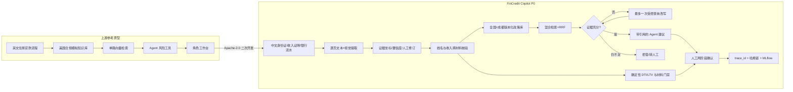
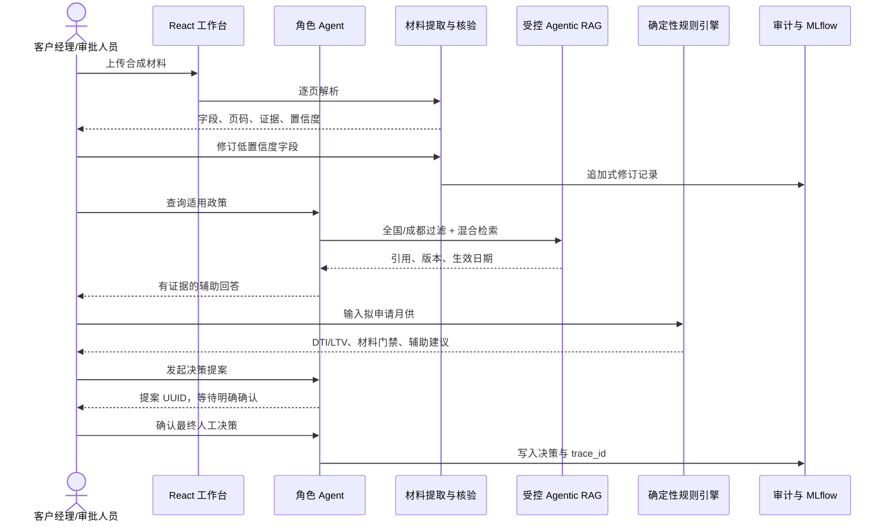

# FinCredit Copilot 二次开发架构

## 设计目标

P0 聚焦“材料可信、政策有据、计算确定、结论人工、过程可追溯”。系统辅助住房贷款受理和审批，不把大模型当作规则计算器，也不允许 Agent 直接写入最终授信结论。

## 从上游原型到 FinCredit Copilot

## 运行时主链路

## 关键安全边界

- 政策时间截点为 2026-08-25。失效或未来政策不能被当作当前依据。
- 全国规则与成都市地方规则按辖区和层级过滤；内部演示阈值必须显式标注，不能冒充监管规则。
- 查询改写最多一次；证据仍不足时拒答或转人工。
- DTI、LTV、材料完整性与一致性门禁由确定性代码计算，并保存输入、公式和规则版本。
- Agent 只能生成建议和待确认提案，最终决策需要有权限的人工确认。
- 每次模型调用、检索、计算、修订和决策均可通过 trace_id 关联查询。

## P0 外范围

P0 不承诺生产级灾备、真实征信接入、电子签章、真实银行流水验真、正式监管法律意见、付费模型压测结果或 OpenShift 生产验收。Helm/OpenShift 配置保留兼容性，但本次验收以 Windows + Docker Desktop 本地演示为准。
